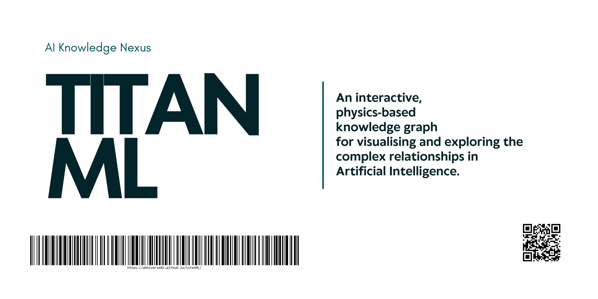

<p align="center">
  
</p>

<h1 align="center">🧠 TitanML — AI Knowledge Nexus</h1>

<p align="center">
  <b>An interactive physics-based knowledge graph for exploring Artificial Intelligence.</b>
  <br/>
  Transform static AI documentation into a living, explorable ecosystem.
</p>

<p align="center">


</p>

 

# 🌐 Live Demo

> 🚀 **Experience TitanML in action**

🔗 **Live Preview:**  
https://abhiverse01.github.io/titanML/


# 🚀 What is TitanML?

TitanML is a **zero-dependency, physics-powered AI knowledge graph engine**.

Instead of reading AI topics linearly, TitanML lets you:

- 🌌 Explore AI concepts visually  
- 🔗 Understand relationships between models and methods  
- 🧠 Navigate Artificial Intelligence as a connected ecosystem  
- ⚡ Interact with a real-time force simulation  

No frameworks.  
No libraries.  
Just engineering.

 

# ✨ Core Features

## ⚛️ Force-Directed Graph Engine
Custom-built physics simulation for natural node positioning.

- Attraction & repulsion forces  
- Organic layout behaviour  
- Smooth transitions  
- Real-time simulation  

 

## 🎨 God Mode Canvas Rendering
High-performance **HTML5 Canvas engine** featuring:

- Directional relationship arrows  
- Category-based gradient colouring  
- HiDPI / Retina optimisation  
- Animated link flows  
- Smooth zoom & drag  

 

## 🧩 Extensible Knowledge Architecture
Add new AI concepts instantly via a simple data object.

No need to modify rendering logic.

 

## 🔗 Deep Linking
Each node is directly addressable:

```

#rag
#transformers
#llm

```

Perfect for sharing specific AI concepts.

 

## 🧭 Navigation History
Full browser history support within the SPA:

- Back / Forward navigation  
- URL state persistence  
- Shareable graph positions  

 

## 📱 Responsive & Accessible
Modern glassmorphism UI designed for:

- Desktop  
- Tablet  
- Mobile  

Keyboard-first navigation is supported.

 

# 🏗 Architecture

TitanML follows a modular separation of concerns.

```

titanML/
│
├── index.html          # Application shell
│
├── assets/
│   ├── titanML.png     # Banner
│   └── preview.gif     # Demo animation
│
├── css/
│   └── styles.css      # Design system & UI styling
│
└── js/
├── data.js         # Knowledge base (extensible)
├── graph.js        # Physics engine & canvas renderer
└── app.js          # State management & UI logic

````

### Design Philosophy

- Single Responsibility per module  
- No framework lock-in  
- Maximum performance  
- Educational clarity  

 

# ⚡ Quick Start

No installation required.

## 1️⃣ Clone the repository

```bash
git clone https://github.com/abhiverse01/titanML.git
cd titanML
````

## 2️⃣ Open the app

Simply open:

```
index.html
```

Or serve locally:

```bash
python -m http.server
```

 

# 🧠 Adding New AI Concepts

All knowledge is stored in:

```
js/data.js
```

Example:

```javascript
{
    id: "quantum-ml",
    name: "Quantum ML",
    category: "training",
    definition: "Machine learning methods applied to quantum computing systems.",
    related: ["transformers", "llm"]
}
```

That’s it.

The engine automatically renders:

* The node
* Its connections
* Its physics interactions

 

# 🎯 Roadmap

## 🔹 Phase 1 — Foundation (Complete)

* Physics engine
* Canvas renderer
* Deep linking
* Modular architecture

## 🔹 Phase 2 — Intelligence Layer

* Search ranking system
* Node clustering
* Concept difficulty layers
* Category filters

## 🔹 Phase 3 — AI-Enhanced Graph

* Dynamic embedding-based relationship generation
* Concept recommendation engine
* Graph-based learning mode

## 🔹 Phase 4 — Ecosystem Expansion

* Plugin architecture
* Multi-domain knowledge graphs
* Research visualisation tools

 

# 🤝 Contributing

Contributions are welcome.

## How to Contribute

1. Fork the repository
2. Create a new branch
3. Commit your changes
4. Open a Pull Request

### Contribution Ideas

* Add new AI domains
* Improve physics tuning
* Enhance UI/UX polish
* Add performance optimisations
* Create learning overlays

 

# 🛠 Tech Stack

| Layer        | Technology                   |
|              |                              |
| Engine       | Vanilla JavaScript (ES6+)    |
| Rendering    | HTML5 Canvas                 |
| Styling      | CSS Variables + Flexbox/Grid |
| Architecture | Modular ES structure         |
| Fonts        | Plus Jakarta Sans            |

 

# 🧭 Vision

TitanML is designed to become:

> 📚 A visual atlas of Artificial Intelligence.

Not just documentation.
Not just a graph.

But a **cognitive interface for exploring intelligence itself.**

Future direction includes:

* AI research mapping
* Learning path generation
* Curriculum visualizers
* Concept evolution timelines

 

# 👨‍💻 Creator

**Abhishek Shah**
AI Engineer • Systems Thinker • Builder

🌐 Portfolio
[https://abhiverse01.github.io](https://abhiverse01.github.io)

💼 LinkedIn
[https://www.linkedin.com/in/theabhishekshah/](https://www.linkedin.com/in/theabhishekshah/)

📧 Email
[abhishek.aimarine@gmail.com](mailto:abhishek.aimarine@gmail.com)

 

# 📄 License

This project is licensed under the MIT License.

 

<p align="center">
  <b>Built with precision, curiosity, and a deep respect for intelligence.</b>
  <br/>
  If you found this project valuable, consider ⭐ starring the repository.
</p>

